CPRS Date Display
==================

**Sam Habiel, Pharm.D.**/
**OSEHRA**/
**22 November 2018**

The last development focused blog post discussed the issue of ??? in reports
and why TIU notes didn't save properly. This blog post discusses the issues
with CPRS Dates. Note that a I present this in an order to make it easiest to
understand, not in the order I did the work. I kept going back and forth
trying to come up with a way to make dates look consistent.

Statement of the Problem
------------------------
CPRS are in one of two formats, and they do not change with the Windows locale.
The most common format is the VistA standard format, MMM DD, YYYY: E.g. MAR 13,
2018. In CPRS, the month name is usually in Title Case: E.g. Mar 13, 2018. The
other format is mm/dd/yyyy; E.g.  03/11/2011, representing March 11, 2011--not
the expected 3 November 2011 commonly expected in the rest of the world.

While the dates in MMM DD, YYYY with English months are unequivocal, they won't
be easily readable by people who don't speak English. The mm/dd/yyyy format 
can and does lead to medical errors.

The objective of this work therefore is to represent dates in a format that can
be changed for each culture, while retaining backward compatibility with the
date format that CPRS currently uses to provide continuity for current users.

I spent several weeks over this issue and I came to this conclusion: There is
no forethought on the format for VistA date display in CPRS, expect for two
accommodations:

* Most dates match the VistA Date Display (MMM DD, YYYY)
* mm/dd/yy was chosen as a date format in many instances because it's short

While date handling was consistent in each part of CPRS; there is little
consistency between the parts.

Some screenshots of previous CPRS Date Handling (i.e. previous to this work)

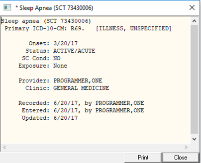

   Dates in Problem Detail

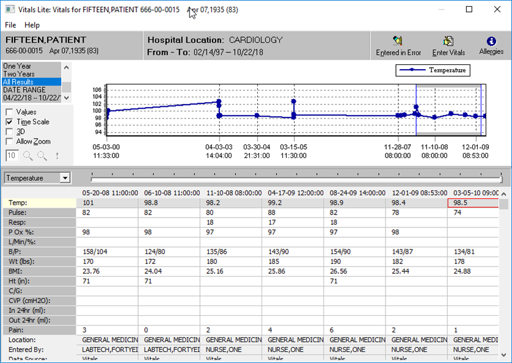

   Dates in Vitals Lite

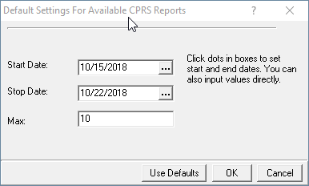

   Reports Date Ranges

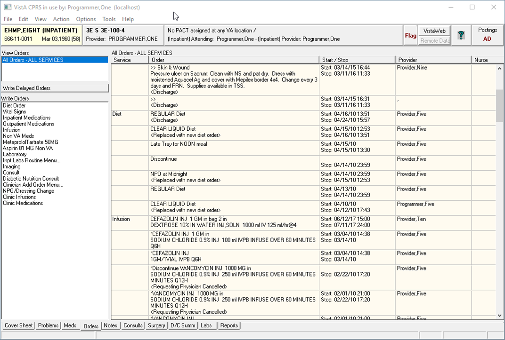

   Orders Tab
 
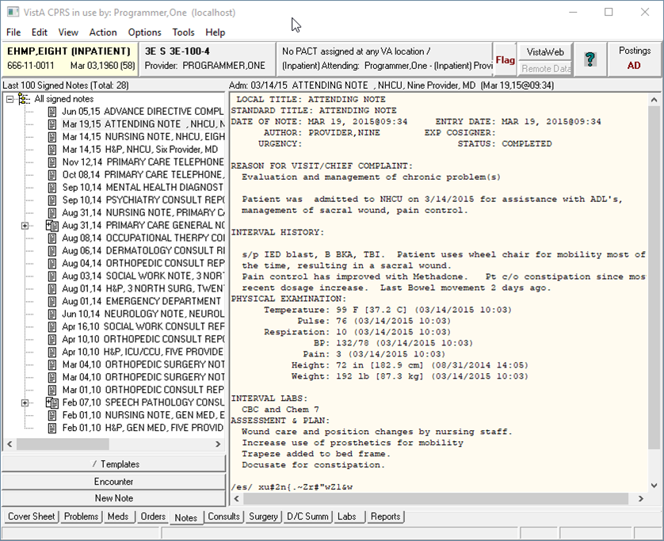

   Notes Tab

First, a Detour
---------------
Our previous work took us into making CPRS talk to the server in Unicode. It
turns out that we missed a spot. I noticed that the Problem List tab
occasionally crashed when I edited a problem. I actually was told about this
problem by somebody else about 4 years ago when they ran VistA in UTF-8 mode
with no other changes. I was surprised that I didn't find it till now. It turns
out that CPRS and the server both had a delimiter of ASCII 255 ($C(255) in M)
for passing data between themselves for edited problems. ONLY when editing
problems. ASCII 255 is not a valid code point in Unicode, and crashes happen
encoding and decoding strings with ASCII 255--the data was sent in a format
like this: old data-255-new data.

The fix was easy: replace ASCII 255 with a valid Unicode code point. A pipe
(|) is not used in the context of the code (and usually is not found in any
Fileman Data)--so I chose that. I could have also chosen a tilde (~). This was
a tiny change in routine ORQQPL1 and pascal unit uProbs.pas.

Commits:

* VistA: OSEHRA-Sandbox/VistA@7016ccbc5d1595afeb23e5bbe1c308a93ede1b9f
* VistA-M: OSEHRA-Sandbox/VistA-M@0c687b43e1e9b1badd4a89918a00836b259d78d1

Steps for Fixing Dates
----------------------

Step 1: Fixing the Server Side
~~~~~~~~~~~~~~~~~~~~~~~~~~~~~~
Many of the dates that show up in CPRS come directly from the server,
especially for reports. To isolate down the issues to those really coming
from CPRS; and essentially a first step, we need to convert the date handling
in VistA to be culture sensitive. I described how to do this in another paper
over here (http://www.smh101.com/articles/VISTAi18nl10n.html). I will repeat 
here the overall strategy:

The overall idea is to use a variable set by the Kernel upon user log-in called
DUZ("LANG"), to represent the user's language. This mechanism is imperfect
since date displays differ even if you use the same language: E.g. American
and British English; but by and large it will work for most users.

To set DUZ("LANG"), you typically set the field "DEFAULT LANGUAGE" in the
"KERNEL SYSTEM PARAMETERS" file. You can set it also user by user.

MSC Fileman (VA Fileman 22.2 has a regression in the routine DIQ) uses
^DD("DD") to do any date display. ^DD("DD") calls DILIBF, which checks the
value of DUZ("LANG"). If it's above 1, then it will check to see if there are
any custom nodes in the language file (#.85) for date display. If it finds them
it executes them.

For date input, %DT handles this in a very similar way: If DUZ("LANG")>1, then
see if there is specific processing code for input.

If you know VistA well, you will notice a glaring omission: XLFDT. XLFDT was
never changed to to internationalized output of dates. Since XLFDT is just a
copy of DILIBF, we just redirect the output to come from there instead.

Here are a few screenshots of the steps we need to take to switch VistA to the
Korean Locale:

1. Go to EVE > Operations Management > Kernel Management Menu > Enter/Edit
   Kernel Site Parameters, and switch the language.

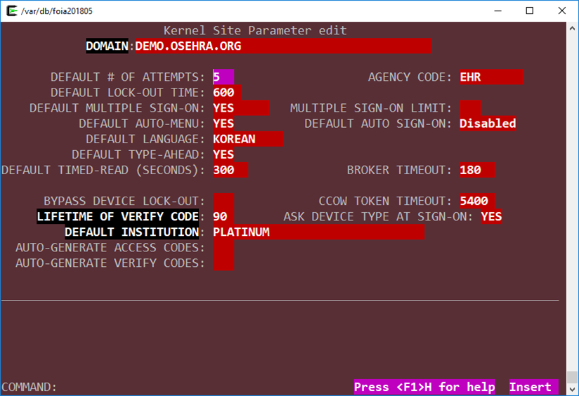

   Kernel System Parameters Change to Korean

2. In the Language (#.85) file, for Korean, add these entries for fields
   DATE INPUT, DATE/TIME FORMAT, DATE/TIME FORMAT (FMTE) (NB: I asked G Timson
   why we have two different fields that do the output; the reason is lost in
   the past now.)

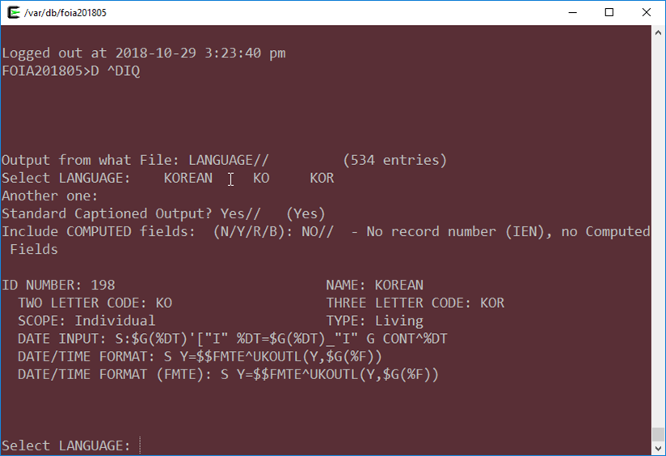

   Fileman Language Nodes

3. The fields reference a new routine. Here are its contents. I came up with
   the contents after reading DILIBF, various experiments and lots of testing.

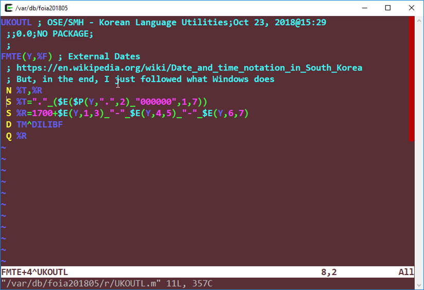

   UKOUTL

4. Fix XLFDT:

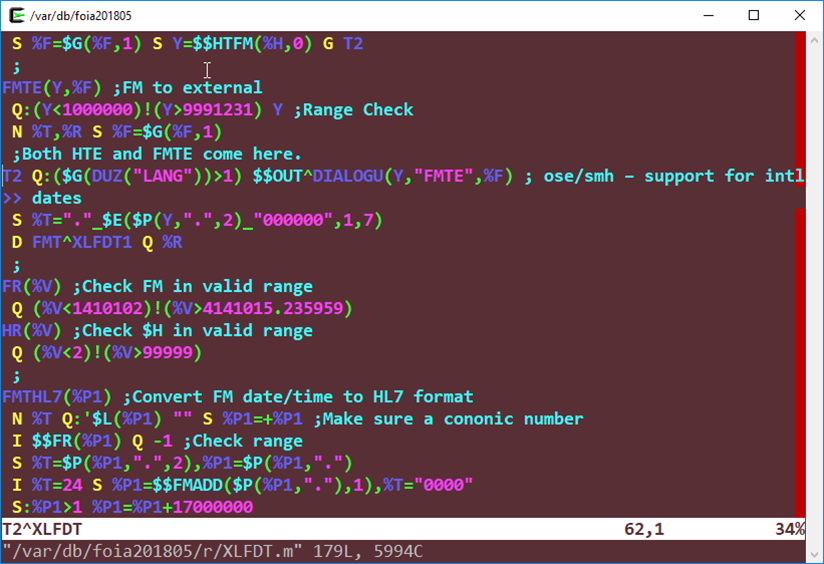

   XLFDT

The result looks like this: very nice, I must say!

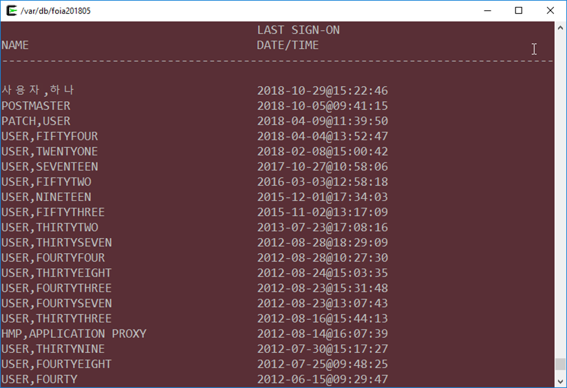

   Result 1

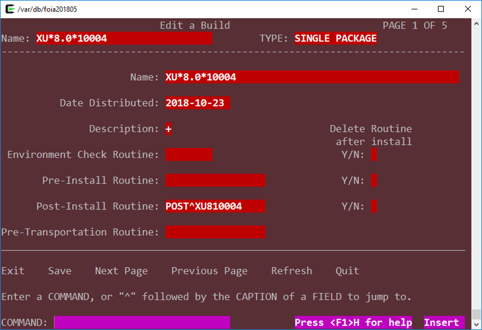

   Result 2

This fixes a significant number of dates. But alas, much of the VistA code
predates the XLFDT API. So for a select small number of routines, we made
some fixes to call XLFDT if DUZ("LANG")>1 (to preserve backwards compatibility
with US English): DATE^TIULS, DATE^ORU, DATE^ORQ20. Problem List needed a
change, which while identical, needs to be explained in more depth: EXTDT^GMPLX;
Vitals has a similar issue: WRTDT^GMVLAT0 is simple; but DATE^GMVGGR2 needs to
be explained. I didn't come up with this list by scanning VistA: I tested CPRS
and found out what works and what doesn't.

If you now run CPRS against VistA configured thus in Korean, you will see that
all reports show the correct date format for Korean. Our next step is to look
at date displays done by CPRS.

Step 2: Investigation of Windows Dates
~~~~~~~~~~~~~~~~~~~~~~~~~~~~~~~~~~~~~~
We earlier saw that CPRS uses two formats for dates: a MMM DD, YYYY format, and
a shorter MM/DD/YY format. It turns out that MS Windows has the concept of
"short" dates and "long" dates--which do not correspond exactly to the two
formats that CPRS uses. Windows changes what the short and long date formats
are for each locale based on your machine's settings (which you can further
customize if you want). Initially I thought of trying to map MMM DD, YYYY to
long and MM/DD/YY to short, but there is no predictability on how dates are
displayed for each locale: it's a completely human cultural concept. I wrote a
small Delphi application to display dates. Here's a dictionary of the Delphi
codes for dates:

* c -> Short Date and Long Time (Long Time includes AM/PM)
* ddddd -> Short Date
* dddddd -> Long Date

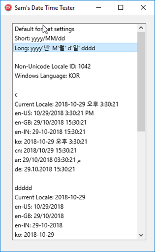

   First Screen

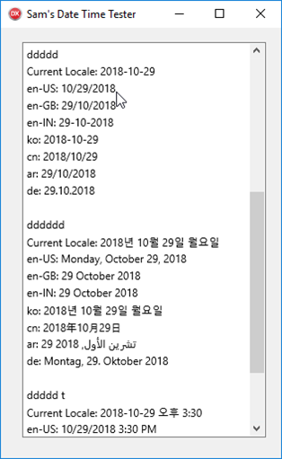

   Second Screen

From this experiment, you will notice that the short dates always include the 4
digit year; and long dates can sometimes be too long. So how would we shoehorn
CPRS into the two standard formats for all locales?

It took me a couple of weeks to come to this realization: The problem is not
really solvable in the current format, as the dates for each country that
Windows supplies do not map neatly to the formats that CPRS users. In any case,
we want backwards compatibility with the current way CPRS runs (i.e. it should
not appear different); but there is no consistency in how dates are actually
handled in CPRS. I found out that you can adjust the "Short Date" and "Long
Date" format in Delphi--and I finally came up with a solution: for the US
Locale, we will keep a dichotomy between short and long dates. For other
locales, we will only use one date format, the one decided by Windows as the
"Short" date format.

Step 3: Converting CPRS Date Formats
~~~~~~~~~~~~~~~~~~~~~~~~~~~~~~~~~~~~
Chronologically I actually did part of this first to experiment with how
to change dates before coming to the short date/long date decision above.

CPRS has code in ORFn.pas, FormatFMDateTime that is the central hub for
formatting date/times. I first rewrote it that so rather than hand-construct
the string of the date, I made it use the standard Windows calls. Here's the
new code:

.. code:: pascal

  function FMDateTimeToDateTime(ADateTime: TFMDateTime): TDateTime;
  { converts a Fileman date/time (type double) to a Delphi date/time }
  var
    ADate, ATime: TDateTime;
    DatePart, TimePart: string;
  begin
    DatePart := Piece(FloatToStrF(ADateTime, ffFixed, 14, 6), '.', 1);
    TimePart := Piece(FloatToStrF(ADateTime, ffFixed, 14, 6), '.', 2) + '000000';
    if Length(DatePart) <> 7 then raise EFMDateTimeError.Create('Invalid Fileman Date');
    if Copy(TimePart, 1, 2) = '24' then TimePart := '23595959';
    ADate := EncodeDate(StrToInt(Copy(DatePart, 1, 3)) + 1700,
                        StrToInt(Copy(DatePart, 4, 2)),
                        StrToInt(Copy(DatePart, 6, 2)));
    ATime := EncodeTime(StrToInt(Copy(TimePart, 1, 2)),
                        StrToInt(Copy(TimePart, 3, 2)),
                        StrToInt(Copy(TimePart, 5, 2)), 0);
    Result := ADate + ATime;
  end;
  
  function FormatFMDateTime(AFormat: string; ADateTime: TFMDateTime): string;
  { formats a Fileman Date/Time using (mostly) the same format string as Delphi FormatDateTime }
  var
    Julian: TDateTime;

  begin
    Result := '';
    if not (ADateTime > 0) then Exit;
    Julian := FMDateTimeToDateTime(ADateTime);
    DateTimeToString(Result, AFormat, Julian);
  end;

This code does not in and of itself decide the format of the date/time to
display. Each module decides on its own format. I used the following guide to
convert:

==============        =========
Original              Converted
==============        =========
mm/dd/yyyy            ddddd (short format)
mmm dd, yyyy          dddddd (long format)
mm/dd/yyyy hh:nn      c
mmm dd, [yy]yy hh:nn  dddddd hh:nn
==============        =========

I scanned all of the CPRS source code to calls for ``FormatFMDateTime`` and
changed them according to the above table.

In testing, I found that I missed one spot: ``SetListFMDateTime``, which
populates the list controls. ``SetListFMDateTime`` delegates its work to
``FormatFMDateTime``, but I just didn't search for it to change the date formats.
So that's what I did next.

I was down to just the orders tab, which did not display the appropriate dates.
It turns out it uses a different call: ``FormatFMDateTimeStr``. I fixed that one
too.

While I was doing the above changes, depending on the context, anything that
goes to the server is formatted as yyyy/mm/dd[@hh:nn], because Fileman can
always understand that regardless of what locale %DT is running under. An
important instance of this was ``TORDateBox.Validate`` in ``ORDtTm.pas``, which
validates any dates that are picked by the user from the calendar box
``TORDateBox``.

TORDateBox had one major other problem: To display the calendar box, the dates
were set into it as a string, rather than as a formal Delphi Date object; even
though it supported the latter. To get back the selected date, the text was
parsed by Windows to give back a date. That dance will only work in US locales;
I changed callers to TORDateBox to set Delphi Dates when initializing the date
box and retrieve Delphi dates when obtaining the final user input.

In the previous section, I said that I needed to keep the US dates the same
but unify date formats to short dates for other locales. This was done at CPRS
start-up in the FormCreate event of fFrame.pas. Here's the code that gets the
Windows language. This outputs ``ENU`` for the Windows running on US English.
``GetLocaleInfo`` is a Windows C API.

.. code:: pascal
  
  function TfrmFrame.GetWindowsLanguage(LCTYPE: LCTYPE {type of information}): string;
  var
    Buffer : PChar;
    Size : integer;
  begin
    Size := GetLocaleInfo (LOCALE_USER_DEFAULT, LCType, nil, 0);
    GetMem(Buffer, Size);
    try
      GetLocaleInfo (LOCALE_USER_DEFAULT, LCTYPE, Buffer, Size);
      Result := string(Buffer);
    finally
      FreeMem(Buffer);
    end;
  end;

This is the new code to reprogram short/long date formats based on locales:

.. code:: pascal
  
  // OSE/SMH - This block is for date internationalization
  // For US users, apply backwards compatiblity with VistA Format
  // All others will get the default internationlized long date format decided
  // --> by Windows.
  fLocale := GetSystemDefaultLCID;
  sUserLang := self.GetWindowsLanguage(LOCALE_SABBREVLANGNAME);
  {$IFDEF DEBUG}
  OutputDebugString(PChar('Non-Unicode Locale: ' + fLocale.ToString));
  OutputDebugString(PChar('User Windows Language: ' + sUserLang));
  {$ENDIF}
  if sUserLang = 'ENU' then          // English United States
  begin
    FormatSettings.LongDateFormat := 'mmm dd, yyyy';
  end
  else // Don't separate out long and short date formats for other languages
  begin
    FormatSettings.LongDateFormat := FormatSettings.ShortDateFormat;
  end;
  // OSE/SMH - End Date i18n block

Based on some experimentation later, I find in the a couple of areas that the c
format (short date + long time) is too long for display, so I change that to
short date + hh:mm.

More testing reveals that while I fixed all the date displays everywhere, there
are 4 areas that still have problems: Labs, Graphing, Problem List, and Vitals.
Labs and Graphing turn out to be easy: for some reason, they did not use the
standard ``FMDateTimeToDateTime`` call in ``ORFn.pas``. So it was a matter of
simply changing all the calls from ``FMToDateTime`` to the former. Problems
and Vitals were complicated enough--they demand their own sections.

Step 4: CPRS Problem List Dates
~~~~~~~~~~~~~~~~~~~~~~~~~~~~~~~
In the Problem List tab, I was met with two challenges: How to support imprecise
dates, which are important in Medicine (I got diabetes 6 years ago) and validation
of external dates. My rewritten ``FormatFMDateTime`` did not support imprecise
dates, and you can put imprecise dates in the Problem List. So I fixed that; and
here's the new code:

.. code:: pascal

  function FormatFMDateTime(AFormat: string; ADateTime: TFMDateTime): string;
  { OSE/SMH - Completely rewritten for Plan-vi }
  var
    Julian: TDateTime;
    year: Integer;
    month: Integer;
    sDateTime: string;

  begin
    Result := '';
    if not (ADateTime > 0) then Exit;
    if ImpreciseFMDateTime(ADateTime) then
    begin
      sDateTime := FloatToStrF(ADateTime, ffFixed, 14, 6);
      year := StrToInt(Copy(sDateTime, 1, 3)) + 1700;
      month := StrToInt(Copy(sDateTime, 4, 2));
      if month > 0 then
        Result := year.ToString + FormatSettings.DateSeparator + month.ToString
      else
        Result := year.ToString;
    end
    else
    begin
      Julian := FMDateTimeToDateTime(ADateTime);
      DateTimeToString(Result, AFormat, Julian);
    end
  end;

  function ImpreciseFMDateTime(ADateTime: TFMDateTime): boolean;
  var
    sDateTime: string;
    month, day: Integer;
  begin
    sDateTime := FloatToStrF(ADateTime, ffFixed, 14, 6);
    month := StrToInt(Copy(sDateTime, 4, 2));
    day   := StrToInt(Copy(sDateTime, 6, 2));
    if (month > 0) and (day > 0) then Result := False
    else Result := True;
  end;

Once I fixed this, I found my first Fileman bug: yyyy/mm is not interpreted by
%DT as a valid date time; even though yyyy is, and yyyy/mm/dd is. We (OSEHRA)
asked for George Timson's help, and now we have a new version of %DT that
supports imprecise dates in the yyyy/mm format 
(OSEHRA-Sandbox/VistA-M@8b84302a44adcbb200ff403853928fbdce169044).

This solution is unfortunately not a complete solution; I will discuss that
below.

The next problem was more difficult to fix; and my fix is really not
satisfactory; but I opted for doing it this way rather than do an extensive
re-write of the code: The Problem List gets the dates from VistA, displays them
on the screen, lets the user modify some of them, and then revalidates all the
previous dates plus the user inputs against the server (ultimately, the
validation uses %DT). The issue I found was that the server was sending and
revalidating the US date format, as the problem list was not using the standard
date APIs. I already asked Fileman to validate dates in the international
format ("I" flag for %DT), so it was rejecting the dates the problem list
package originally sent. E.g., 11/20/2012 is not a valid date in the "I" format,
as there is no such thing as a 20th month. The easy fix was to make the
problem list package send the correctly formatted dates for the locale it's in.
The fix is in ``EXTDT^GMPLX``. I added the first line, which will only activate
if DUZ("LANG") is greater than 1.

.. code:: M

  EXTDT(DATE) ; Format External Date; OSE/SMH - updated to use standard API
   I $G(DUZ("LANG"))>1 Q $$FMTE^XLFDT(DATE)
   N X,MM,DD,YY,YYY S X="",DATE=$P(DATE,".") Q:'DATE ""
   S MM=+$E(DATE,4,5),DD=+$E(DATE,6,7),YY=$E(DATE,2,3),YYY=$E(DATE,1,3)
   S:MM X=MM_"/" S:DD X=X_DD_"/" S X=$S($L(X):X_YY,1:1700+YYY)

With that change, the problem list now works reliably in a Korean Locale. But
there is a bug now in the US locale, which I haven't fixed. If we have problems
with imprecise dates, and we use CPRS with the US locale, VistA right now sends
the external date as MM/YY, which when revalidated in VistA, can get converted
to DD/MM. I noted the problem and I hope to fix it in the next phase of the
project when I work again on CPRS.

Overall, the solution is unsatisfactory. Most of CPRS sends Timson Formatted
dates (a.k.a. Fileman dates) to the server, and that--like the Unix Epoch Format
--does not change with locales as it is an internal storage format for dates.
Problem List, while having all the Fileman dates at its disposal, does not use
them to save the problem; it uses the external dates. The fix is obvious; but
it requires a lot of changes in the Problems Delphi code.

Step 5: CPRS Vitals DLL
~~~~~~~~~~~~~~~~~~~~~~~
The Vitals DLL ultimately posed similar problems as the Problem List; but
first, we needed to get the source code. We didn't have the source code for the
latest version of the Vitals DLL
(https://foia-vista.osehra.org/Patches_By_Application/GMRV-VITALS/GMRV_5_37_SCRUBBED.zip),
but we got the version from last year first
(https://foia-vista.osehra.org/Patches_By_Application/GMRV-VITALS/VITL5_P27_SOURCE_scrubbed.zip).
From there, I made the same changes as before in CPRS. We eventually encountered
a similar problem to the Problem List, but more insidious--and frankly, careless.
The server side sent dates in MM-DD-YY format, and to convert that into Delphi/
Windows dates, it had to parse the date as a string. It turns out that MM-DD-YY
is not a valid US Windows Date. The Delphi Code read the string date and replaced
the - with / to produce MM/DD/YY which can be parsed by Windows (!). That obviously
will not work for any other locale than the US locale; and the fact it works
reliably is a miracle. As with the problem list, fixing this to do this properly
requires more changes to the code than I was willing to make for this project.
As a result, I opted for a similar solution: change the M date in order to use
standard APIs for date formatting so that they can be interpreted by Windows.
One extra change is that the US date format should be sent as MM/DD/YY; now we
don't have to convert - to /--which destroys parsing for other locales. Again,
it's an unsatisfactory solution; but I don't know whether I have a better one
in the short amount of time I have to work on this module. The M code that got
changed is in WRTDT^GMVLAT0 and DATE^GMVGGR2.

I did find another problem that had to do with the standard Windows DateTime
picker (TDateTimePicker in Delphi). It seems that you couldn't get the .MaxDate
property twice in non-US locales. I get an error saying that my date is greater
than max of 1899 something. I didn't have any time left to troubleshoot this,
so I just fixed the code so that .MaxDate gets set once (and it really only needs
to be set once).

Step 6: CPRS Alerts
~~~~~~~~~~~~~~~~~~~
This was an easy fix: the alert date time came from VistA and the code needed to
be edited to send the correct date for the locale. The routine edited is ORWORB.
Unfortunately, an unanticipated 'clever' trick in Delphi causes some problems.
In order to sort alerts, the dates are reformatted from MM/DD/YYYY to YYYY/MM/DD
to sort the alerts in reverse chronological order (latest first); and then the
dates and converted back to MM/DD/YYYY. Well, if your date, like Korean, does
not have "/", then you will be in for a small surprise. A bug for another time.

Result of the Work
------------------
Here are some nice screenshots.

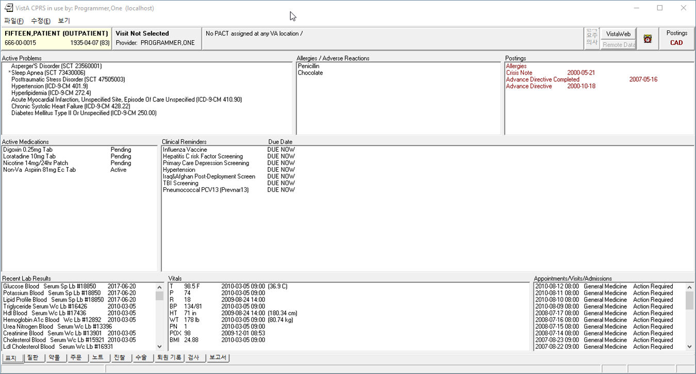

   Final Cover Sheet

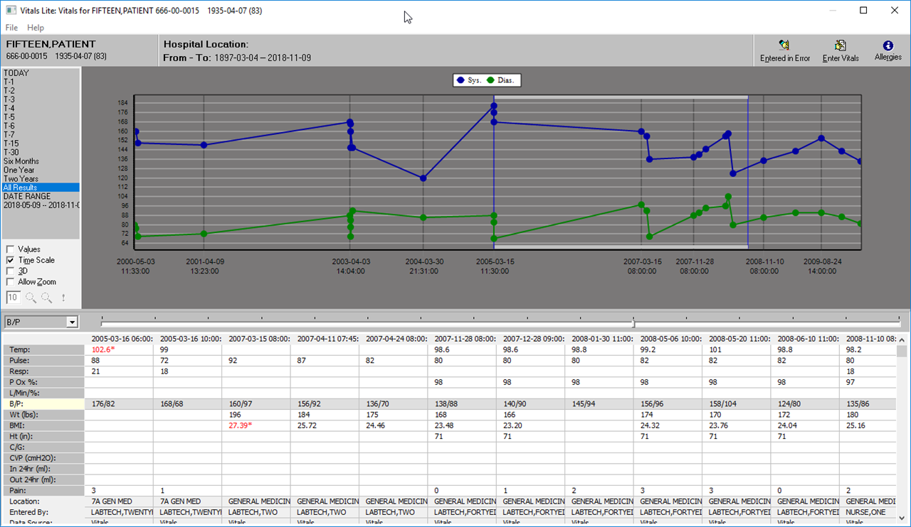

   Final Vitals

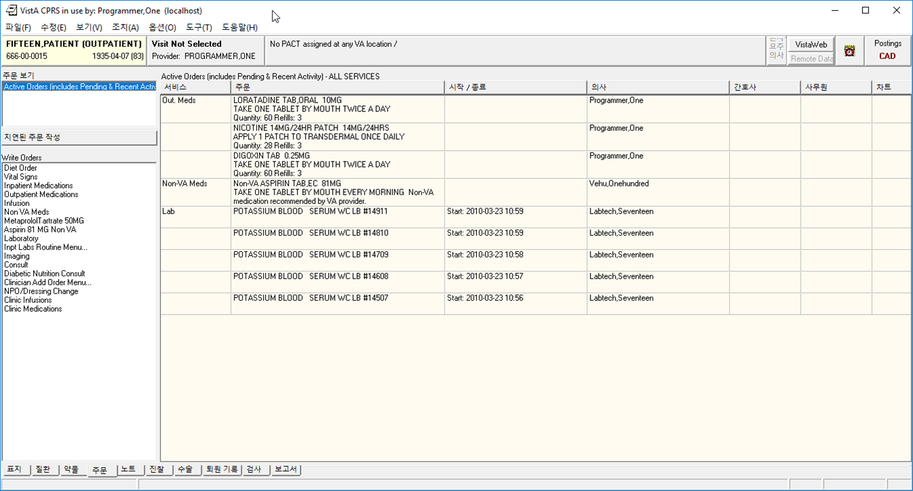

   Final Orders

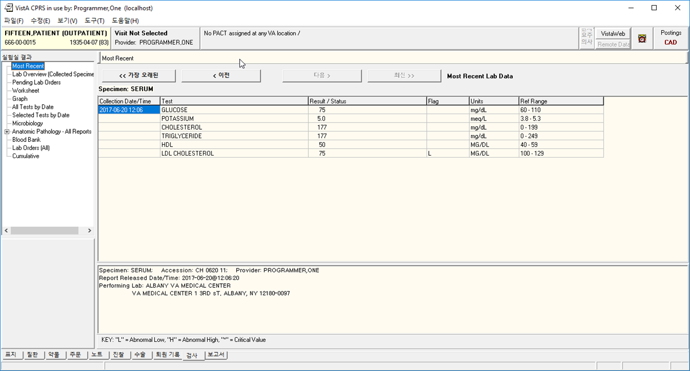

   Final Labs

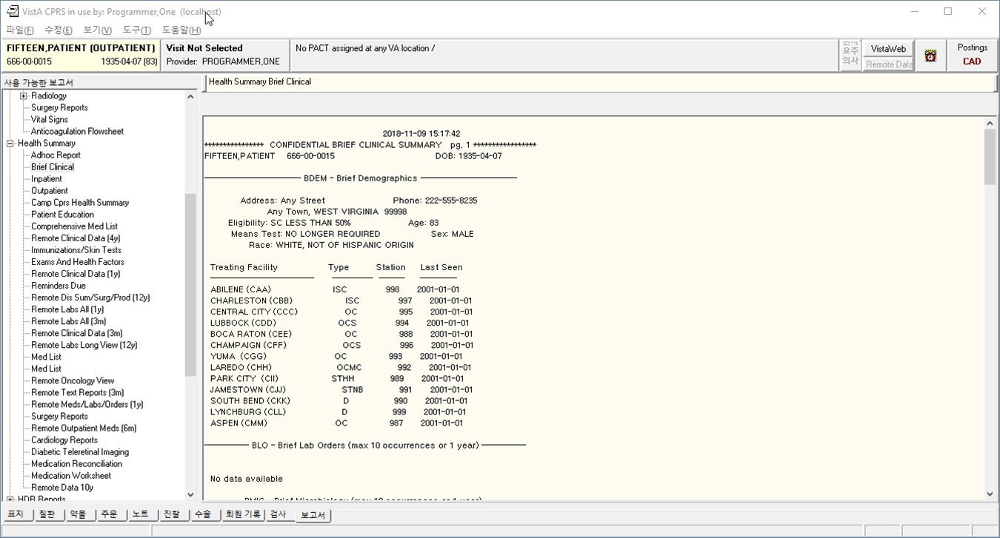

   Final Reports

Remaining Bugs
--------------
In my last days testing this, I found 3 bugs in my work. I don't have time to
fix them now; but I documented them in JIRA. Here they are:

* Inexact Year/month problem list item not portable across locales: I broke the
  US locale handling: If you save it once, and try to modify it, it won't save
  again properly. It will mangle the date. This has to do with the issue of
  round tripping this from VistA and back, going through Delphi display, and
  going back to VistA.  E.g. 2011/08 will save into Vista as Aug 2011.  In US
  locale, will be displayed in Delphi as 11/08.  When resaved in VistA, will be
  interested as Aug 8 2018 (current year).
* Order Summary Report (Reports Tab) still has US dates on it. Probably an M
  side issue.
* Alert Dates do not show up correctly. The Delphi code mangles the dates from
  US mm/dd/yyyy format to yyyy/mm/dd to sort the notifications, and then
  unmangles back into mm/dd/yyyy. This will work for a US date; but if a date
  contains dashes, it makes the date look weird. This shows up in the
  notifications in CPRS.

Summary of Changes
------------------
M-Side
~~~~~~

==============        =========                                         =========
Routine               Commit                                            Change Description 
==============        =========                                         =========
ORQQPL1               VistA-M@0c687b43e1e9b1badd4a89918a00836b259d78d1  Delimiter Change to valid Unicode
XLFDT                 VistA-M@3553178098a324c0dfa57b5f4ca898e2b08b5058  XLFDT support for i18n dates
0.85+LANGUAGE.zwr     VistA-M@3553178098a324c0dfa57b5f4ca898e2b08b5058  Fileman Date i18n. Calls UKOUTL.
UKOUTL                VistA-M@3553178098a324c0dfa57b5f4ca898e2b08b5058  New Routine
GMVLAT0               VistA-M@e25743a581ea4a62efe48ee1495b2204929e48cc  Date i18n
ORQ20                 VistA-M@c60cfd65b3a031d22448fdbf829b0faee2c71d08  Date i18n
ORU                   VistA-M@170a6c563dcd88528cb8ffe1cda8c72ec0b535fa  Date i18n
GMPLX                 VistA-M@e25743a581ea4a62efe48ee1495b2204929e48cc  Date i18n
TIULS                 VistA-M@170a6c563dcd88528cb8ffe1cda8c72ec0b535fa  Date i18n
GMVGGR2               VistA-M@072ece422a448cdd2721baa39eb50b0a7421ef4e  Date i18n
ORWORB                VistA-M@0cc977d9e3dd2361b353ac6ce5642d331fc1ef38  Date i18n
DIDT                  VistA-M@8b84302a44adcbb200ff403853928fbdce169044  %DT from MSC Fileman
==============        =========                                         =========

CPRS 
~~~~
(Merge Commit 2379bc1f99c9e643f889eccde0ea143fb9ac3793)

==============                                 =========                                               =========
Unit                                           Commit                                                  Change Description 
==============                                 =========                                               =========
CPRS-Chart/uProbs.pas                          VistA@7016ccbc5d1595afeb23e5bbe1c308a93ede1b9f          Delimiter Change
CPRS-Chart/Consults/fConsults.pas              VistA@4f9712e219d847d3020a96e4658cfe883abde747          Date i18n
CPRS-Chart/Consults/uConsults.pas              VistA@4f9712e219d847d3020a96e4658cfe883abde747          Date i18n
CPRS-Chart/Encounter/fDiagnoses.pas            VistA@8f2864e18408a02031d2108cc50ca1647ebb84bd          Date i18n
CPRS-Chart/Encounter/fEncVitals.pas            VistA@8f2864e18408a02031d2108cc50ca1647ebb84bd          Date i18n
CPRS-Chart/Encounter/fEncounterFrame.pas       VistA@8f2864e18408a02031d2108cc50ca1647ebb84bd          Date i18n
CPRS-Chart/Encounter/fPCEEdit.pas              VistA@8f2864e18408a02031d2108cc50ca1647ebb84bd          Date i18n
CPRS-Chart/Encounter/uPCE.pas                  VistA@8f2864e18408a02031d2108cc50ca1647ebb84bd          Date i18n
CPRS-Chart/Options/fOptionsOther.pas           VistA@8f2864e18408a02031d2108cc50ca1647ebb84bd          Date i18n
CPRS-Chart/Options/fOptionsSurrogate.pas       VistA@8f2864e18408a02031d2108cc50ca1647ebb84bd          Date i18n
CPRS-Chart/Orders/fODAllgy.pas                 VistA@8f2864e18408a02031d2108cc50ca1647ebb84bd          Date i18n
CPRS-Chart/Orders/fODBBank.pas                 VistA@8f2864e18408a02031d2108cc50ca1647ebb84bd          Date i18n
CPRS-Chart/Orders/fODLab.pas                   VistA@8f2864e18408a02031d2108cc50ca1647ebb84bd          Date i18n
CPRS-Chart/Orders/fODMedIV.pas                 VistA@8f2864e18408a02031d2108cc50ca1647ebb84bd          Date i18n
CPRS-Chart/Orders/fODMedNVA.pas                VistA@8f2864e18408a02031d2108cc50ca1647ebb84bd          Date i18n
CPRS-Chart/Orders/fODMeds.pas                  VistA@8f2864e18408a02031d2108cc50ca1647ebb84bd          Date i18n
CPRS-Chart/Orders/fOrderVw.pas                 VistA@8f2864e18408a02031d2108cc50ca1647ebb84bd          Date i18n
CPRS-Chart/Orders/fOrdersEvntRelease.pas       VistA@8f2864e18408a02031d2108cc50ca1647ebb84bd          Date i18n
CPRS-Chart/Orders/rODAllergy.pas               VistA@8f2864e18408a02031d2108cc50ca1647ebb84bd          Date i18n
CPRS-Chart/Templates/uTemplates.pas            VistA@8f2864e18408a02031d2108cc50ca1647ebb84bd          Date i18n
CPRS-Chart/Vitals/uVitals.pas                  VistA@8f2864e18408a02031d2108cc50ca1647ebb84bd          Date i18n
CPRS-Chart/fARTAllgy.pas                       VistA@8f2864e18408a02031d2108cc50ca1647ebb84bd          Date i18n
CPRS-Chart/fDCSumm.pas                         VistA@8f2864e18408a02031d2108cc50ca1647ebb84bd          Date i18n
CPRS-Chart/fEncnt.pas                          VistA@8f2864e18408a02031d2108cc50ca1647ebb84bd          Date i18n
CPRS-Chart/fFrame.pas                          VistA@8f2864e18408a02031d2108cc50ca1647ebb84bd          Date i18n
CPRS-Chart/fGraphs.pas                         VistA@8f2864e18408a02031d2108cc50ca1647ebb84bd          Date i18n
CPRS-Chart/fLabs.pas                           VistA@8f2864e18408a02031d2108cc50ca1647ebb84bd          Date i18n
CPRS-Chart/fMeds.pas                           VistA@8f2864e18408a02031d2108cc50ca1647ebb84bd          Date i18n
CPRS-Chart/fNotes.pas                          VistA@8f2864e18408a02031d2108cc50ca1647ebb84bd          Date i18n
CPRS-Chart/fProbCmt.pas                        VistA@8f2864e18408a02031d2108cc50ca1647ebb84bd          Date i18n
CPRS-Chart/fProbEdt.pas                        VistA@8f2864e18408a02031d2108cc50ca1647ebb84bd          Date i18n
CPRS-Chart/fPtSel.pas                          VistA@8f2864e18408a02031d2108cc50ca1647ebb84bd          Date i18n
CPRS-Chart/fReports.pas                        VistA@8f2864e18408a02031d2108cc50ca1647ebb84bd          Date i18n
CPRS-Chart/fSurgery.pas                        VistA@8f2864e18408a02031d2108cc50ca1647ebb84bd          Date i18n
CPRS-Chart/fVitals.pas                         VistA@8f2864e18408a02031d2108cc50ca1647ebb84bd          Date i18n
CPRS-Chart/fvit.pas                            VistA@8f2864e18408a02031d2108cc50ca1647ebb84bd          Date i18n
CPRS-Chart/rCore.pas                           VistA@8f2864e18408a02031d2108cc50ca1647ebb84bd          Date i18n
CPRS-Chart/rReports.pas                        VistA@8f2864e18408a02031d2108cc50ca1647ebb84bd          Date i18n
CPRS-Chart/rTIU.pas                            VistA@8f2864e18408a02031d2108cc50ca1647ebb84bd          Date i18n
CPRS-Chart/uCaseTree.pas                       VistA@8f2864e18408a02031d2108cc50ca1647ebb84bd          Date i18n
CPRS-Chart/uCore.pas                           VistA@8f2864e18408a02031d2108cc50ca1647ebb84bd          Date i18n
CPRS-Chart/uDCSumm.pas                         VistA@8f2864e18408a02031d2108cc50ca1647ebb84bd          Date i18n
CPRS-Chart/uDocTree.pas                        VistA@8f2864e18408a02031d2108cc50ca1647ebb84bd          Date i18n
CPRS-Chart/uEventHooks.pas                     VistA@8f2864e18408a02031d2108cc50ca1647ebb84bd          Date i18n
CPRS-Chart/uProbs.pas                          VistA@8f2864e18408a02031d2108cc50ca1647ebb84bd          Date i18n
CPRS-Chart/uSurgery.pas                        VistA@8f2864e18408a02031d2108cc50ca1647ebb84bd          Date i18n
CPRS-Chart/uTIU.pas                            VistA@8f2864e18408a02031d2108cc50ca1647ebb84bd          Date i18n
CPRS-Lib/ORDtTm.pas                            VistA@93c19e67a6fdb3563222694770d613f25c3d11d7          Date i18n
CPRS-Lib/ORDtTmRng.pas                         VistA@8f2864e18408a02031d2108cc50ca1647ebb84bd          Date i18n
CPRS-Lib/ORFn.pas                              VistA@df3df42e6948f2f99d52ef5de0985d44507af1a7          Date i18n
CPRS-Lib/fFrame.pas                            VistA@cd92fc27dd8599d94f28b12d92cf942d8e63515c          Date i18n
CPRS-Chart/Orders/rODLab.pas                   VistA@377d59d52a85eb76e8dd0755e29fb1258c43cce7          Date i18n
CPRS-Chart/fProbs.pas                          VistA@377d59d52a85eb76e8dd0755e29fb1258c43cce7          Date i18n
CPRS-Chart/rCore.pas                           VistA@377d59d52a85eb76e8dd0755e29fb1258c43cce7          Date i18n
CPRS-Chart/rCover.pas                          VistA@377d59d52a85eb76e8dd0755e29fb1258c43cce7          Date i18n
CPRS-Chart/rReports.pas                        VistA@377d59d52a85eb76e8dd0755e29fb1258c43cce7          Date i18n
CPRS-Chart/rSurgery.pas                        VistA@377d59d52a85eb76e8dd0755e29fb1258c43cce7          Date i18n
CPRS-Chart/rTIU.pas                            VistA@377d59d52a85eb76e8dd0755e29fb1258c43cce7          Date i18n
CPRS-Chart/Options/fOptionsReportsDefault.pas  VistA@93c19e67a6fdb3563222694770d613f25c3d11d7          Date i18n
CPRS-Chart/Orders/fOrders.pas                  VistA@23a92e7781857370a2893ccd1fd1a497db69f11c          Date i18n
CPRS-Chart/fGraphs.pas                         VistA@a0ea30f102c4c50d3b79f4d3498eb8033eb1c16d          Date i18n
CPRS-Chart/fLabPrint.pas                       VistA@a0ea30f102c4c50d3b79f4d3498eb8033eb1c16d          Date i18n
CPRS-Chart/fLabs.pas                           VistA@a0ea30f102c4c50d3b79f4d3498eb8033eb1c16d          Date i18n
VITALSDATAENTRY/fGMV_InputLite.pas             VistA@98ecfe4d8c4162998006083b21687ae951207ad5          MaxDate Property issue
VITALSCOMMON/mGMV_MDateTime.pas                VistA@e92141043a01e0ec87fe8237f5a21e4ba996b8c0          Date i18n
VITALSUTILS/uGMV_Common.pas                    VistA@e92141043a01e0ec87fe8237f5a21e4ba996b8c0          Date i18n
VITALSUTILS/uGMV_Const.pas                     VistA@e92141043a01e0ec87fe8237f5a21e4ba996b8c0          Date i18n
VITALSVIEW/mGMV_GridGraph.pas                  VistA@e92141043a01e0ec87fe8237f5a21e4ba996b8c0          Date i18n
CPRS-Chart/fVitals.pas                         VistA@e92141043a01e0ec87fe8237f5a21e4ba996b8c0          Date i18n
==============                                 ==========                                              =========

Summary of Phase 1
------------------
This project (CPRS Internationalization) started not knowing exactly all the
items that could be addressed in the limited time frame. We addressed what we
felt to be the major issues, which are the following:

1. CPRS Read/Write to VistA in Unicode
2. CPRS Localization Strategy and Framework
3. CPRS display of correct date format depending on Windows Locale

There are some items that we couldn't do in the time allotted; but these should
be easy to fix

1. Embedded strings in the source code were not converted to resourcestrings.
2. Vitals displays imperial units in some places.

Next Steps
----------
Phase 2 involves M infrastructure (i.e. the Server) internationalization. It
will involve more proper changes to some of the M code changed in Phase 1. Here
are some of the tasks that we anticipate doing, time permitting:

* Move non-portable code in XWBRW to Kernel (use of $ZL, $ZE).
* Fix XLFNAME code to allow non-US names
* Localize Data in Fileman (e.g. Cover sheet headers)
* Localize Menu System
* Localize a simple workflow in Outpatient Pharmacy
* Put in Korean Lexicon and test with CPRS
