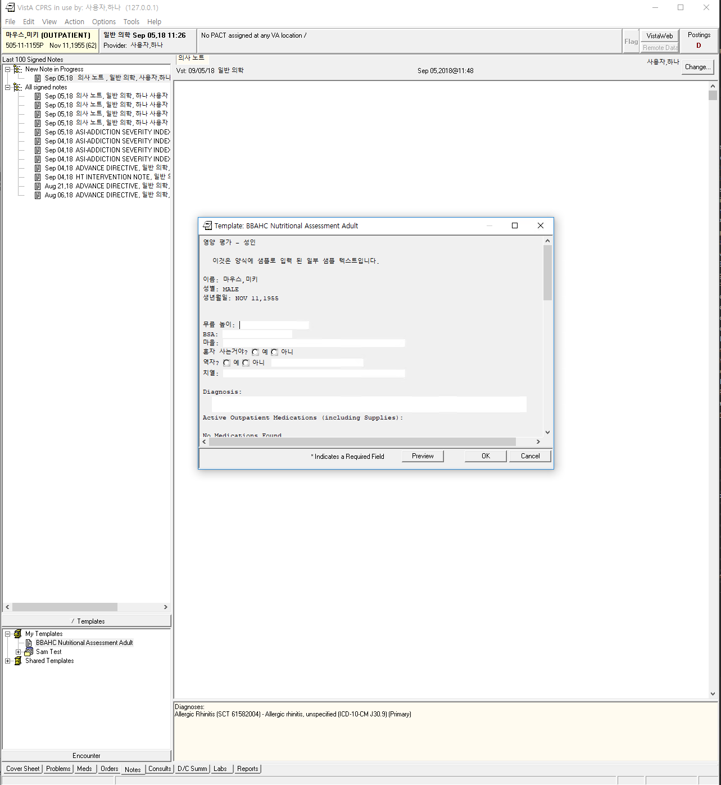
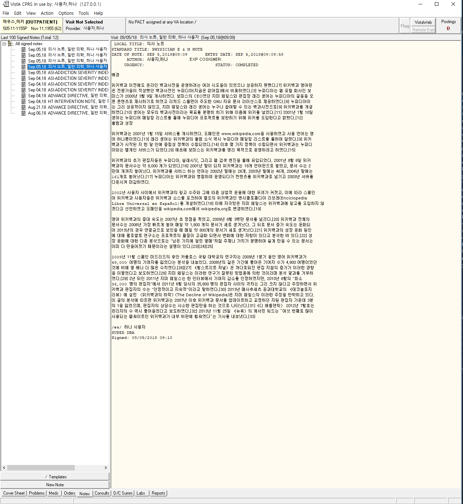

Reports and TIU unicode support
===============================
After the conversion of CPRS to talk to VistA in Unicode, we needed to find all
the places in CPRS that for some reason or another do not take or display
Unicode text. By and large, these places have actually been easy to find (which
is a good thing!). One obvious place that had issues was the Notes tab. We
couldn't paste any non ASCII text; and if we typed it in (not pasted it), it
wouldn't save. Another place was that in various reports
(which are mostly accessed by double-clicking), all we saw was ???? for Unicode
characters.

??? In Reports
--------------
This was hard to find, but easy to fix. It turns out that the problem was in
``QuickCopy`` in ``Packages/Order Entry Results Reporting/CPRS/CPRS-Lib/ORFn.pas``.
This has specifically to do with the MemorySteam writes and reads. In Delphi versions
that support Unicode, if you do not supply the encoding when reading and writing, the
encoding defaults to ANSI. That was easy to fix.

Before

.. code:: pascal

     str[0].SaveToStream(ms);
     ms.Seek(0, soFromBeginning);
     str[1].LoadFromStream(ms);

After

.. code:: pascal

     str[0].SaveToStream(ms, TEncoding.Unicode);
     ms.Seek(0, soFromBeginning);
     str[1].LoadFromStream(ms, TEncoding.Unicode);

That was it! The full commit is here: cc6d1c9fb8339c1179005d7b38cc29d9c224a215.

TIU Notes: Pasting and Saving
-----------------------------
It was frustrating when trying to paste into notes: error messages; and saved data would get corrupted. The fixes were needed in two places:

* Method ``ScrubTheClipboard`` in ``Packages/Order Entry Results
  Reporting/CPRS/CPRS-Chart/ORExtensions.pas`` existed for the sole purpose of
  cleaning copied and pasted text. It did stuff like replace smart quotes with
  regular quotes and then replace extended ASCII with question
  marks. I don't know exactly what happened to it when I pasted Korean text in;
  but suffice it to say, it was obviously not needed now that the database is
  in Unicode. So that source code was completely removed. For details, see
  commit 1377e53f482ece06ebcfe59cd0d6a5f79984ab18.
* Function ``FilteredString`` in ``Packages/Order Entry Results
  Reporting/CPRS/CPRS-Lib/ORFn.pas`` was called when saving data. Again, it
  performed ASCII cleanup. It also did some cleanup of spaces. I rewrote it: it
  only cleans spaces up now. Commit 7294f19140ff6d017cd79822924fec6e07ae15f4.

With that work, it is now possible to paste any Unicode text and have it saved to VistA. Some nice screenshots:

A TIU Template note containing a lot of Korean:

A full TIU note with Korean copied from Wikipedia:

I tested templating and it worked very well. I remember from my days in Jordan
that templates garbled our Windows-1256 Arabic--so I was glad to see that I
didn't need to make any changes at all to get it work. I tried template objects
that returned Korean text; and Template fields that returned Korean text (like
Yes/No in Korean).

TIU Notes: RPC ORWTIU CHKTXT
----------------------------
In the first draft of the software, I actually missed this in my testing. In addition
to all the Delphi Checks for empty notes, there is an RPC that is run to check to see
if the note is empty. Guess what? It checked each note character to see if it was empty
by its ASCII code. If it can't find a single ASCII code in the printable ASCII range,
it considers the document invalid. I missed this because all my testing previously included
a single printable ASCII character--especially spaces.

The previous code called in EMPTYDOC+13^TIULF looked like this:

.. code:: M

  I $A(TIUCHAR)'<33&($A(TIUCHAR)'>123)!($A(TIUCHAR)=125) S TIUY=0 Q

I changed it to look like this:

.. code:: M

  I TIUCHAR'=124,TIUCHAR'?1C S TIUY=0 Q  ; *10001*; Previously, individual ASCII chars where checked (<32 & >125)

The old code is somewhat suspect, in that it does not include 126 (``~``),
which is also a printable character. And I now notice that I forgot the $ASCII
on TIUCHAR.  Which means that I need to go back and do another revision for
this code. Maybe later this week.
