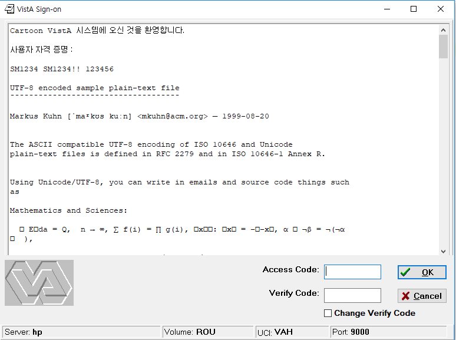
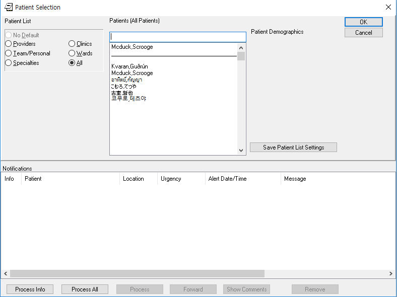

Converting CPRS to talk to VistA using UTF-8
============================================

Introduction to Plan VI (aka Plan 6)
------------------------------------
OSEHRA just started a project called Plan VistA Internationlization (VI)--and
in order to distinguish it from VistA Imaging, we decided to call it Plan 6.
The objective of the project is to allow VistA to be easily modified by
international users for use in their own countries in local languages and local
dates. It is not intended to be a thorough implementation in a specific language.

One of the first stages of OSEHRA's Plan 6 work is for CPRS to be able to talk
to VistA in UTF-8. Since Delphi XE (released in 2009), Delphi supported Unicode
strings as UTF-16. This allows us for the first time to transparently support
different character sets within the same sysatem, and it allowed us to
represent glyph based languages (such as Chinese) for the first time in CPRS.

I (Sam Habiel) was very involved in choosing a character set for VistA's
implementation in Jordan, where various elements needed to be represented in
Arabic. You can find my adventures linked from my `home page
<http://smh101.com>`_. In the end, due to the fact that Delphi 2006 only allowed
us to use single bytes for each character, we ended up using Windows Code Page
1256 for all of VistA. It worked, but it required us to write some hooks in
order to talk to other systems that used Unicode (e.g. Printers).

Modifying the XWB Broker - Try 1 and why were only partially successful
-----------------------------------------------------------------------
We found out quickly that we needed to modify a single broker file: `wsockc.pas
<https://github.com/OSEHRA/VistA/blob/master/Packages/RPC%20Broker/BDK/Source/wsockc.pas>`_.
It was easier said than done. Writing network communication code is hard; and
trying to adapt the existing older string types turned out to be problematic.
These are the main issues:

* Pascal has been continously enhanced--most bafflingly to me: it has three
  different string types for different circumstances--all of which were being
  used in the codebase: Pascal strings; regular reference counted strings; and
  zero terminated strings.
* Correct Unicode converstion methods are hard to find. There are so many of
  them, and some of them produce the wrong result (e.g. `UTF8ToString()
  <http://docwiki.embarcadero.com/Libraries/Tokyo/en/System.UTF8ToString>`_)
  strips the initial character of the output--possibly it wants to create a
  Pascal string, not a reference counted string.
* ``wsockc.pas`` was not refactored with the advent of Delphi XE--the algorithm
  was kept the same as in the previous single byte encoding versions of Delphi.
  However, the algorithm was incorrect at this point in time whenever any multibyte
  string was entered into CPRS.

The following is the main receive loop as as result of our first try. Code
containing "//" was previous code that was commented out.

.. code:: pascal

  //  BufSend, BufRecv, BufPtr: PChar;
  BufSend, BufRecv, BufPtr: PAnsiChar;
  ...

  repeat
    BytesRead := recv(hSocket, BufPtr^, BytesLeft, 0);

    if BytesRead > 0 then begin
      if BufPtr[BytesRead-1] = #4 then begin
  //    sBuf := ConCat(sBuf, BufPtr);xe3
        sBuf := sBuf + Utf8ToUnicodeString(BufPtr);
      end else begin
        BufPtr[BytesRead] := #0;
  //    sBuf := ConCat(sBuf, BufPtr);
        sBuf := sBuf + Utf8ToUnicodeString(BufPtr);
      end;
      Inc(BytesTotal, BytesRead);
    end;

    if BytesRead <= 0 then begin
      if BytesRead = SOCKET_ERROR then
        NetError('recv', 0)
      else
        NetError('connection lost', 0);
      break;
    end;
  until BufPtr[BytesRead-1] = #4;
  sBuf := Copy(sBuf, 1, pos(#4,sBuf)-1);

This code worked for receiving data from VistA, but was incorrect in other
respects. The biggest problem we had was that the BytesRead count did not
reflect the end of the string anymore--and we didn't know anyway in which to
fix this--thus the hacky copy at the end that guesses the end of the string.
I also learned later that ``pAnsiChar`` has some hidden semantics that make them
convert strings into the current code page being used in the system.

Network Communication, the correct way
--------------------------------------
I have previously converted a VistA TCP Communication Library to use Unicode:
`BMXNet
<https://trac.opensourcevista.net/svn/BMXNET_RPMS_dotNET_UTILITIES-BMX/trunk/cs/bmx_0200scr/BMX2/BMXNet/BMXNetLib.cs>`_,
in C#. I knew that we needed to send and receive bytes; not strings. But I
didn't know how I can do that in Delphi. Plus the concept of multiple types of
strings was very confusing to me.

The following resources really helped me:

* An Embracadero `Tech Note <https://www.danysoft.com/free/delphiunicodemigration.pdf>`_ about migrating old Delphi code bases to Unicode.
* Rudy Velthuis' `blog post <http://rvelthuis.de/articles/articles-pchars.html>`_ about PChars and strings.
* Marco Cantu's `Object Pascal Handbook <http://www.marcocantu.com/objectpascalhandbook/>`_, which is required reading if you are just getting started in Pascal like I was.
* This `Stackoverflow question <https://stackoverflow.com/questions/21574201/delphi-byte-array-to-string>` which told me that most of the Delphi Runtime Library (aka RTL) functions/procedures that operates on bytes use the ``TBytes`` type, which is a dynamic array of bytes.

I found out from Marco Cantu's book that as of Delphi XE7, you can concatenate
two TBytes arrays using a ``+`` sign; rather than manually setting a new array
by copying memory. That was the big magical ingredient in my new algorithm.

Some simple examples to illustrate my changes, before showing you again the read loop:

LPack is the most important call to get right in order to be able to send Unicode data to VistA. LPack Before:

.. code:: pascal

  function LPack(Str: String; NDigits: Integer): String;
  Var
    r: Integer;
    t: String;
    Width: Integer;
    Ex1: Exception;
  begin
    r := Length(Str);
    // check for enough space in NDigits characters
    t := IntToStr(r);
    Width := Length(t);
    if NDigits < Width then
    begin
      Ex1 := Exception.Create('In generation of message to server, call to LPack where Length of string of '+IntToStr(Width)+' chars exceeds number of chars for output length ('+IntToStr(NDigits)+')');
      Raise Ex1;
    end;
    t := '000000000' + IntToStr(r);               {eg 11-1-96}
    Result := Copy(t, length(t)-(NDigits-1),length(t)) + Str;
  end;

LPack After:

.. code:: pascal

  function LPack(Str: String; NDigits: Integer): TBytes;
  var
    r: Integer;
    t: String;
    t2: String;
    Width: Integer;
    Ex1: Exception;
  begin
    r := TEncoding.UTF8.GetByteCount(Str);
    // check for enough space in NDigits characters
    t := IntToStr(r);
    Width := Length(t);
    if NDigits < Width then
    begin
      Ex1 := Exception.Create('In generation of message to server, call to LPack where Length of string of '+IntToStr(Width)+' chars exceeds number of chars for output length ('+IntToStr(NDigits)+')');
      Raise Ex1;
    end; //if
    t := '000000000' + IntToStr(r);               {eg 11-1-96}
    t2 := Copy(t, length(t)-(NDigits-1),length(t));
    Result := TEncoding.UTF8.GetBytes(t2) + TEncoding.UTF8.GetBytes(Str);
  end; //function LPack

The main changes, which are echoed throughout, is that length is measured using ``TEncoding.UTF8.GetByteCount()`` and rather than strings, we send bytes, which are converted from strings using ``TEncoding.UTF8.GetBytes()``, which returns a TBytes array. TBytes are concatenated together using a + sign to get the ``Result`` for the function.

Let's now show the new receive call:

.. code:: pascal

  function TXWBWinsock.NetCall(hSocket: TSocket; imsg: Tbytes): PChar; // JLI 090805
  var
    BufSink: TBytes;                                            // to /dev/null
    BufSend: TBytes;                                            // Send Buffer
    BufRecv: TBytes;                                            // Receive Buffer
    LBufSend: integer;                                          // Send Buffer Length
  ...

    { -- loop reading TCP buffer until server is finished sending reply }
    BytesTotal := 0;
    repeat
      SetLength(BufRecv, Buffer32k + BytesTotal);
      BytesRead := recv(hSocket, BufRecv[BytesTotal], Buffer32k, 0);
      if BytesRead <= 0 then
      begin
        if BytesRead = SOCKET_ERROR then
          NetError('recv', 0)
        else
          NetError('connection lost', 0);
        break;
      end; //if BytesRead <= 0
      Inc(BytesTotal, BytesRead);
    until BufRecv[BytesTotal-1] = $4; //repeat
    SetLength(BufRecv, BytesTotal);
    BufRecv[BytesTotal-1] := $0;

    Result := StrAlloc(BytesTotal);
    StrCopy(Result, PChar(TEncoding.UTF8.GetString(BufRecv)));

Using TBytes allowed me several advantages:

* This is a reference counted array type. I don't need to free it--and I could
  get rid of all the try/finally constructs whose only purpose was to clear
  temporary buffers.
* I can read data effectively in the same buffer in the loop. Most of the time,
  I will only need to perform a single read from the socket.
* There was a previous limitation of 32k for the size of the reply in VistA.
  This is now removed.
* There is no discrepancy anymore between the number of bytes read and the
  location of the end of the string, as we are still dealing with bytes until
  the very end.

The main other function that was refactored was ``BuildPar``. With these changes,
we can now send and receive UTF-8 data to VistA.

What about the Broker in VistA?
-------------------------------
The XWB Broker in VistA needed a couple of changes:

* XWBRW needs to use $ZL and $ZE instead of $L and $E, in order to talk in
  bytes, not in characters.
* Either XWBTCPM (when using xinetd) or %ZISTCPS (native listener) needs to 
  set the read/write character set to M. This, unfortunately, is only available
  as of GT.M v6.3-001A.

I took the opportunity to refactor XWBRW while I am at it to make it simpler
and increase the buffer sizes--which were still at 255 characters. I also
commented it very well in order to make sure that I can maintain it in the
future. You can find the new version `here <https://github.com/OSEHRA-Sandbox/VistA-M/blob/plan-vi/Packages/RPC%20Broker/Routines/XWBRW.m>`_.

What about Caché?
-----------------
If you were paying attention in the previous paragraph, you will notice that my
changes to XWBRW will only work on GT.M/YDB.

Caché is problematic in its Unicode support. It uses a mix of UTF-8/ASCII for
the lower 128 bytes of ASCII and what seems to be UCS-2 for code points above
127; and it has no equivalents to $ZL/$ZE to count bytes. I asked Intersystems
Support; and it looks like a Japanese support person recommended that I should
best use ``$ZCONVERT(string,"O","UTF8")`` and then use $L and $E with that.

Right now XWBRW is a first draft; all calls to $ZL or $ZE will need to be made
in %ZOSV which will implement it correctly for the M Virtual Machine being run.

Other changes
-------------
There are two other minor changes that need to be mentioned:

* The Introductory Text box in CPRS couldn't display Unicode character
  correctly. It's a custom component; Kevin Toppenberg helped me switch it out
  with the stock TRichEdit and it now displays the characters correctly.
* There is a bug in Windows (I think) where calling ``ConvertSidToStringSidA``
  in a Korean locale gives you garbage. This is easily fixed by calling
  ``ConvertSidToStringSidW``, which gives you the correct UTF-16 string for the
  Security Identifier.

End Result
----------
Here are some screenshots to show you the result of the work. This screenshot is
of `Markus Kuhn's UTF-8 sample file
<https://www.cl.cam.ac.uk/~mgk25/ucs/examples/UTF-8-demo.txt>`_ entered into
the Introductory Text in VistA. Note that some glyphs show up as just rectangles--
that is due to the fact that the font doesn't support the glyph.

The following is a few patients entered in VistA, in the following languages (below
the line indictating the previously selected patient): Icelandic, English, Thai,
Japanese Hiragana, Japanese Kanji/Chinese and Korean.

