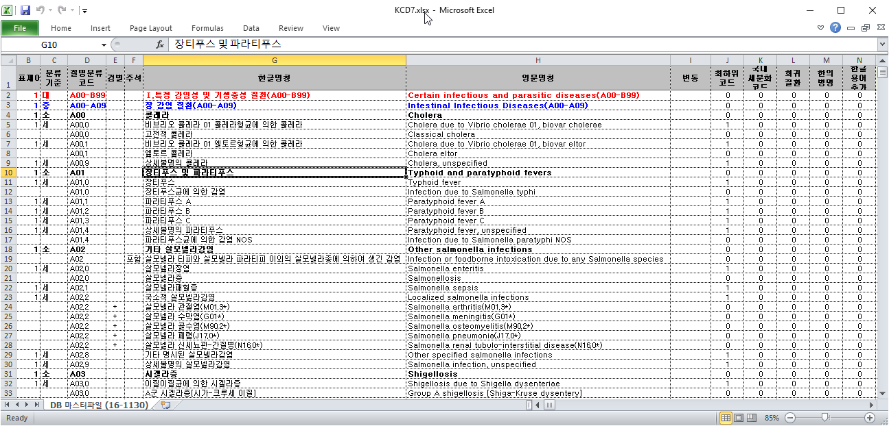
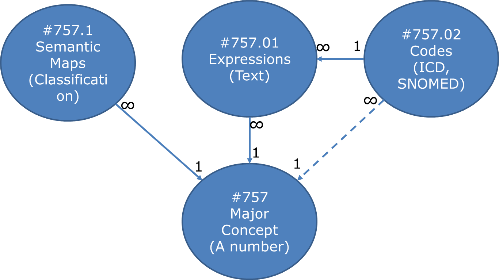
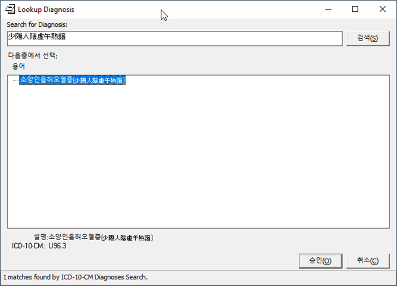
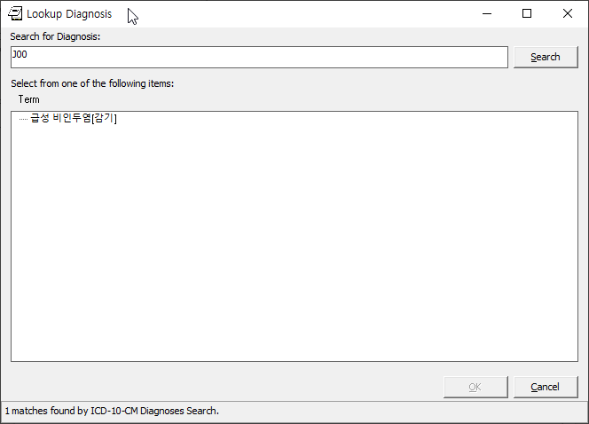
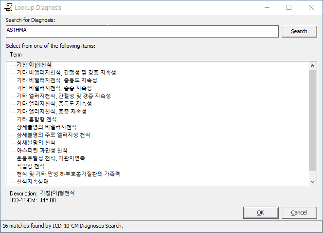
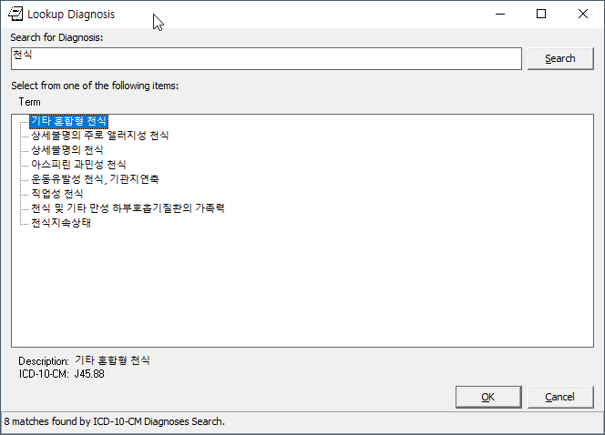
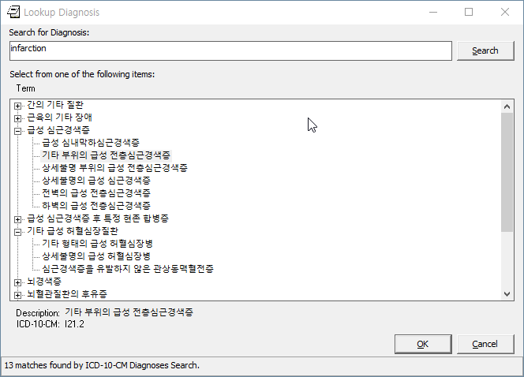

Adding Korean ICD-10 To Lexicon
===============================

**Sam Habiel, Pharm.D.**/
**OSEHRA**/
**17 May 2019**

It has been a while since the last full blog post on the Plan VI project. This 
post will be the first in a series focusing on the changes needed in the VistA
M side code in order for VistA to be usable outside of the US.

This post focuses on modifying the VistA Lexicon to contain the Korean ICD-10
system in order for VistA to be usable in Korea for clinical purposes. We end
up looking at two different ways in which we can do that.

Statement of the Task
---------------------
The Korean ICD-10 system used in Korea is known as KCD-7. We wanted to be able
to use KCD-7 in CPRS for encounters instead of ICD-10-CM-US. The KCD-7 I was
provided only included diagnoses, not the ICD-10 procedures. So my focus was
only on diagnoses.

I was supplied a spreadsheet of the KCD-7 codes. Here's a screenshot

   KCD-7
   
Research on how to Update ICD-10 Codes
--------------------------------------
Before starting translation of the US entries, I did some research on how the
ICD-10 codes are updated. I was lucky in finally receiving (after many attempts)
a response to a FOIA request from the VA on the code that updates the Lexicon.
I also was lucky in knowing a developer who worked on the Lexicon, who was able
to answer some of the questions on some processes not documented in the code.

The FOIA response is a zip file `over here
<https://github.com/OSEHRA-Sandbox/VistA-M/releases/download/kcd7/LEXFOIA_ICD-10_scrubbed.zip>`_.
For ease of reference, I extracted all the routines into the
`reference-lex-icd10-code <./reference-lex-icd10-code/>`_ folder.

Here's a table of my summary exploration of the code.

==============                      =========
Routine                             Purpose  
==============                      =========
^ZZLEXX (MAIN -> CS -> DIA)         Menus
LOAD^ZZLEXXAA                       Main Driver
ZZLEXXAM (PATH, OPEN, CLOSE)        File system operations (paths hardcoded)
NTO^ZZLEXXAM                        Comparison
FILE^ZZLEXXAC                       Main Updater
EN^ZZLEXMD                          Update Counts
==============                      =========

For me, the most important part of this code is FILE^ZZLEXXAC. So here's a
detailed breakout of this code.

+------------+----------------------------------------------------------+
| Tag        | Description                                              |
+============+==========================================================+
| CODE       | Add ICD-10 Code to File 80                               |
+------------+----------------------------------------------------------+
| STAT       | Update 80/66 (Status Multiple)                           |
+------------+----------------------------------------------------------+
| SHORT      | Update 80/67 (Short Description Multiple)                |
+------------+----------------------------------------------------------+
| LONG       | Update 80/68 (Long Description Multiple)                 |
+------------+----------------------------------------------------------+
| LEX^ZZLEXXAD |                                                        |
|            | * Precalculate IENs (see note below)                     |
|            | * Add 757 (Expression) pointer to 757.01                 |
|            | * Add Long Description to 757.01 .01 field               |
|            | * Create 757.001 (Frequency) entry dinummed to 757       |
|            | * Create 757.02 (ICD Code) (points to 757 and 757.01)    |
|            | * Create 757.1 (Semantic Map) entry                      |
+------------+----------------------------------------------------------+
| SUP^ZZLEXXAS | Applies commonly used medical abbreviations. Adds to   |
|            | - 80/68/2                                                |
|            | - 757.01/5                                               |
+------------+----------------------------------------------------------+
| IX^ZZLEXXAC | Indexes the entries in                                  |
|            | - 80                                                     |
|            | - 757                                                    |
|            | - 757.001                                                |
|            | - 757.01                                                 |
|            | - 757.02                                                 |
|            | - 757.1                                                  |
+------------+----------------------------------------------------------+

IEN pre-calculation is rather intriguing. There is no reason that I could see
to need to pre- calculate the IENs for the Lexicon. You could just get the next
available number. Whatever the reason, the precalculation looks like this:

* ICD-10: 5 million to 7 million
* SNOMED-CT: >7 million
* All other terminolgies: Next available number; less than 5 million.

Initial Plan and Surpise
------------------------
Initially, I thought that the task will simply involve the translation of
ICD-10; essentially, the replacement of the English Text with Korean text. So
that's what I started doing.

What I eventually found out though is that there was a low overlap between
ICD-10-CM-US and KCD-7. Only 6286 of 12871 clinically selectable codes in KCD-7
were also clinically selectable in the US. I did not do a thorough investigation,
but I think I can divide the issues into three types:

* The US version of ICD-10 is older, and does not contain many codes. E.g.
  X69.1, which is "Intentional self-poisoning by and exposure to other and
  unspecified chemicals and noxious substances, residential institution".
* Various US codes specifY the number of times something happened (initial,
  episode, second episode, or more than that). Many of the accident codes
  (starting with with X) don't have any commonality due to that.
* More detailed subspecifications. Either the US version is more subspecified;
  or the Korean version is. For example, to select a tuberculosis of the lung 
  diagnosis in KCD-7, you need to to select A15.00 (Tuberculous of lung with
  cavitation, confirmed by sputum microscopy with or without culture), or
  A15.01 (Tuberculous of lung without cavitation or unspecified, confirmed by
  sputum microscopy with or without culture). In the US, you only have one
  code: A15.0, tuberculosis of the lung.

Due to that, doing a translation is not quite feasible. A translation would be
a translation of ICD-10-CM-US, which are not the codes being used in Korea. So
that left me with two avenues to pursue: Delete the US version and replace it
with KCD-7; or inactivate the US version and add KCD-7. The latter option is
harder and would have required more investigation; so I opted to doing the
easier option: Replace ICD-10 in VistA.

First Attempt to Replace ICD-10
-------------------------------
From the table above, you will notice that the code that calls ``LEX^ZZLEXXAD``
just creates new entries in all the files for any new codes. So I backtracked
from that, assuming that to replace the US ICD-10, I need to delete all the
ICD-10 codes add add new ones in their place. I did that, but later discovered
that was the wrong way to do it. Later on in this document, I explain why. You
can already see from the table below that the deletion process was rather 
messy. 

Deletion
~~~~~~~~

==============                      =========
File                                Which Entries (numbers are IENs)
==============                      =========
80 (no pointers to Lexicon)         Entries >= 500000
757.02 (Codes)                      Entries 5000000-7000000
→ 757.1 (Semantic map)              Pointed to entries from codes
→ 757.01 (Expression)               "
→ 757 & 757.001 (Major Concept)     "
757.01 (Expression)                 Delete 5000000-7000000 entries that were not previously deleted
→ 757 & 757.001 (Major Concept)     Pointed to entries from expression
757.1 (Semantic map)                Delete 5000000-7000000 entries that were not previously deleted
→ 757 & 757.001 (Major Concept)     Pointed to entries from Semantic map
==============                      =========

Adding Codes
~~~~~~~~~~~~

==============                      =========
File                                Fields
==============                      =========
80 (ICD)                            .01 (code); 1 (coding system); 66 (status); 67 (short description); 68 (long description)
757 (Major Concept)                 .01 (pointer to 757.01)
757.001 (Concept Frequency)         .01 (pointer to 757); others
757.01 (Expression)                 .01 = text; 1 = p757
757.02 (Codes)                      .01 = p757.01; 1 = code; 2 = coding system; 3 = p757; 8 = Activation History
757.1 (Semantic Map)                .01 = p757; 1 = 6 ; 2 = 47
==============                      =========

How to Distribute the Lexicon
-----------------------------
Now that we have a new Lexicon, the big question is how to give it to others.
I took a look at how the VA distributed their Lexicon. I read through the
post-installs of the KIDS builds for the Lexicons, and I saw that they loaded
a file system file containing data that looks like this:

::

  S ^LEX(757,0)="MAJOR CONCEPT MAP^757P^7475423^769194"
  ^LEXM(757,2)
  S ^LEX(757,346250,0)="346250"
  ^LEXM(757,3)
  S ^LEX(757,346251,0)="346251"
  ^LEXM(757,4)
  S ^LEX(757,346252,0)="346252"
  ^LEXM(757,5)
  S ^LEX(757,346253,0)="346253"
  ^LEXM(757,6)
  S ^LEX(757,346254,0)="346254"
  ^LEXM(757,7)
  S ^LEX(757,346255,0)="346255"
  ^LEXM(757,8)
  S ^LEX(757,346256,0)="346256"
  ^LEXM(757,9)
  S ^LEX(757,"B",346250,346250)=""
  ^LEXM(757,10)
  S ^LEX(757,"B",346251,346251)=""

This looks very similar to a global output format generated by various M
implementations; and it's similar to how KIDS transports globals. But the
question was: how did the developers generate this data, which seems to be a
journal file dump? I looked at the VA Code that updates the ICD-10 codes, but
there were no clues there. I had the fortune to talk to a developer who
previously worked on the Lexicon team who told me the answer: there is a small
program that compares an update instance of VistA with a reference non-update
instance. Based on the comparison, the program generates set and kill statements
that will bring up the non-update instance data to match the update instance
data. The set and kill statements are distributed in a global that accompanies
a Lexicon patch (see the patches `here <https://foia-vista.osehra.org/Patches_By_Application/LEX-CLINICAL%20LEXICON/>`__).
This patch is eventually installed on the non-update instance, making it now
equal to the update instance; and now updating can begin again.

This method, while complicated, is actually the best way to generate the least
amount of disk and cpu activity when installing a Lexicon patch into a VistA
instance.

I did not get this infromation until after I created the first release. It was
rather simple: Delete all the old Lexicon Globals for the files we modified,
and replace them.  Here's the list of the globals: 

* ICD9
* LEX(757)
* LEX(757.001)
* LEX(757.01)
* LEX(757.02)
* LEX(757.1)
* LEX(757.033)

Unfortuantely, this was rather computationally expensive as the globals were
very large. The KIDS build file was 1.2GB large; and it took over an hour to
install; plus it generated a large amount of Journal file activity.

Problems with First Attempt to Load ICD-10
------------------------------------------
I had a feeling that the way I was deleting entries in the Lexicon was
incorrect because I saw seeing pointer entries being deleted that were not in
the ICD-10 number range (if you recall, that's between 5000000-7000000). I had
to understand the Lexicon better, so I decided to look carefully at one example
of an entry that I deleted that wasn't supposed to be deleted using Fileman
pointer tools introduced in Fileman 22.2::

  ***MAJOR CONCEPT MAP: 1650***
  FILE 757.001 (CONCEPT USAGE)
           `1650        1650                        MAJOR CONCEPT
  FILE 757.01 (EXPRESSIONS)
           `7939        Anorexia                    MAJOR CONCEPT
           `7940        Food appetite, decreased    MAJOR CONCEPT
           `7941        Anorexias                   MAJOR CONCEPT
  FILE 757.02 (CODES)
           `8461        Anorexia                    MAJOR CONCEPT
           `8462        Anorexia                    MAJOR CONCEPT
           `8463        Anorexia                    MAJOR CONCEPT
           `8464        Anorexia                    MAJOR CONCEPT
           `8465        Anorexia                    MAJOR CONCEPT
           `8468        Anorexia                    MAJOR CONCEPT
           `8471        Food appetite, decreased    MAJOR CONCEPT
           `5021748     Anorexia (ICD-10)           MAJOR CONCEPT
  FILE 757.1 (SEMANTIC MAP)
           `2510        1650                        MAJOR CONCEPT
           `2511        1650                        MAJOR CONCEPT

As you can see, there are multiple coding systems (codes not shown above; see
the tables below) using the same entry in the file Major Concept (#757) to say
that all the codes for Anorexia; and all the expressions for saying Anorexia
all mean the same thing.  Therefore, while deleting the ICD-10 entry in the
CODES file was okay to do, deleting all the pointed to entries was not, as they
can be pointed to by other entries.
           
This analysis helped me figure out that the reference VA code that updated
ICD-10 is not how it has been done historically; I was essentially following
a flawed model.

While there is a more comprehensive diagram for the Lexicon in the VA manual,
I decided to make this simple diagram for my and others' edification:

   Simplified Lexicon Diagram

For comparison, on page 18 of the `technical manual <https://www.va.gov/vdl/documents/Clinical/Lexicon_Utility/lextm2_0.pdf>`__,
you can find the more complex VA diagram.

Here are three tables of the Anorexia concept that may be easier to understand;
the codes table includes the code for each.

.. table:: Concept #1650 (IEN = 7930) - Expressions

  +-----------+---------------------------+----------------------------+
  | IEN       | Expression Text           | Expression type            |
  +===========+===========================+============================+
  | 7939      | Anorexia                  | Major Designation          |
  +-----------+---------------------------+----------------------------+
  | 7940      | Food Appetite, decreased  | Other Form                 |
  +-----------+---------------------------+----------------------------+
  | 7941      | Anorexias                 | Plural                     |
  +-----------+---------------------------+----------------------------+

.. table:: Concept #1650 (IEN = 7930) - Semantic Maps

  +-----------+------------------------------+----------------------------+
  | IEN       | Semantic Class               | Semantic Type              |
  +===========+==============================+============================+
  | 2510      | Disease/Pathological Process | Signs and Symptoms         |
  +-----------+------------------------------+----------------------------+
  | 2511      | Disease/Pathological Process | Disease or Syndrome        |
  +-----------+------------------------------+----------------------------+

.. table:: Concept #1650 (IEN = 7930) - Codes

  +-----------+---------------------------+-------------------+--------+
  | IEN       | Expression                | Coding System     | Code   |
  +===========+===========================+===================+========+
  | 8461      | Anorexia (#7939)          | AI/RHEUM          | ANORX  |
  +-----------+---------------------------+-------------------+--------+
  | 8462      | Anorexia (#7939)          | COSTAR            | U000037 |
  +-----------+---------------------------+-------------------+--------+
  | 8463      | Anorexia (#7939)          | CRISP             | 2116-3651 |
  +-----------+---------------------------+-------------------+--------+
  | 8464      | Anorexia (#7939)          | COSTART           | ANOREXIA |
  +-----------+---------------------------+-------------------+--------+
  | 8465      | Anorexia (#7939)          | ICD-9             | 783.0  |
  +-----------+---------------------------+-------------------+--------+
  | 8468      | Anorexia (#7939)          | SNOMED 2          | F-60014 |
  +-----------+---------------------------+-------------------+--------+
  | 8471      | Food appetite, decreased  | SNOMED 2          | F-60014 |
  |           | (#7940)                   |                   |        |
  +-----------+---------------------------+-------------------+--------+
  | 5021748   | Anorexia (#7939)          | ICD-10            | R63.0  |
  +-----------+---------------------------+-------------------+--------+

A couple of interesting asides: Only 1465/72819 US ICD-10 code entries in the
Lexicon are actually shared with other coding systems; and this is even less
for SNOMED-CT. I personally specualte that asserting relationships between
various vocabularies just became too much of a burden for the terminologists
at the VA when all the codes that were used were SNOMED-CT and ICD-10.

Second Attempt to Load ICD-10 
-----------------------------
Discussion
~~~~~~~~~~

Rather than do the haphazard deletion technique used previously, to preserve
existing relationships in the Lexicon, I would just delete codes in file 80
above 500,000 (ICD-10 codes); and all codes in the CODES files (757.02) that
are marked as ICD-10 codes. Not included in the previous load was loading
ICD-10 categories into the CHARACTER POSITIONS file (757.033); now this is done
as well. These are easy to identify as they all start with the letters "10D".
Notice that we not deleting any of the associated codes in the other 757* files;
these won't harm anything if they are left alone and nobody uses them. Ideally,
I would look for all entries that nobody uses and then clean them up; but I
imagine I would find a lot of interesting archaelogy; so ultimately, it's not
worth the time right now.

Adding codes is done in two different steps. First, the straightforward loading
of codes into file 80 and categories into file 753.033.

* 80 (ICD DIAGNOSIS): .01 (code); 1 (coding system); 66 (status); 67 (short description); 68 (long description)
* 757.033 (Character Positions) for ICD-10 Categories (소 in KCD7 spreadsheet):
  01 (10D + code); .02 (code); .03 (date); .04 (coding system);
  1 (status); 2 (name/title); 3 (description)

Then we need to populate the other Lexicon files (757*). Previously, we created
brand new entries in all files.  However, we want to be true to the spirit of
the Lexicon, and make sure that we create entries that will interoperate with
the rest of the Lexicon. To do that, we now use the English text of the
ICD from the KCD-7 spredsheet to match to an existing expression in the Lexicon
(file 757.01). If that exists, we use the Major Concept (757) and Semantic
Class (757.1) associated with that. If not, we create brand new entries for the
Major Concept (757) and Semantic Class (757.1) and English Expression (757.02).
In both cases, we need to create the Korean Expression (757.02). The last item
to create is the code. The code can be theoretically linked with either the
English or Korean expression (as they are two separate entries pointing to the
same Major Concept); but for this project I chose to point it to the Korean
expression.

This all sounds too complicated. The `source code
<https://github.com/OSEHRA-Sandbox/VistA-M/blob/plan-vi/Packages/Korea%20Specific%20Modifications/Routines/UKOP6LEX.m>`__
for importing the KCD-7 spreadsheet I hope is understandable, and may be a
better reference. Start with the ADDLEX tag.

Also, here's a table that shows the fields updated:

==============                      =========
File                                Fields
==============                      =========
757 (Major Concept)                 .01 (pointer to 757.01)
757.001 (Concept Frequency)         .01 (pointer to 757); others
757.01 (Expression)                 .01 = text; 1 = p757
757.02 (Codes)                      .01 = p757.01; 1 = code; 2 = coding system; 3 = p757; 8 = Activation History
757.1 (Semantic Map)                .01 = p757; 1 = 6; 2 = 47
==============                      =========

We end up reusing 1483 Expressions out of 19187 end user selectable codes in 
KCD-7. This is very close to the ICD-10-CM-US of 1465 of 72819.

The Tilde Bug
~~~~~~~~~~~~~
There is a standard technique of jumping forward in a M index by appending a
tilde to the text you want, and then using $ORDER to move forewards in the
index. It's easy to explain this using an example. Say you have the following
entries:

* CALCIUM CARBONATE
* CALCIUM LACTATE
* CALCIUM SULFATE
* MAGNESIUM CARBONATE

If you know that "CALC" expands to CALCIUM only, and you want to skip it, you
can append ~ to CALC to jump to the MAGNESIUM using $ORDER.

This trick is used in a few places in Fileman with comma searching (partial
wildcard matching of entries).

This trick works only with ASCII. It works because the tilde is the last
printable ASCII character, so ordering past it will get you the next higher
character. This won't work for any non-ASCII data. What usually happens is that
you go into an endless loop with non-ASCII data as you never get to the end of
an index (~ with non-ASCII data moves you back, not forward, and you loop
through the data again, add the tilde, and go back, and so forth).

Luckily, I found this problem while I was working for EHS in Jordan when we
were implementing VistA there. George Timson fixed it by introducing a new
DD("OS") node called "HIGHESTCHAR". Instead of a tilde, you are supposed to use
^DD("OS",^DD("OS"),"HIGHESTCHAR").

We found this issue in ONE^LEXAS2 and EXP^LEXAS6. They are now both fixed.

Random Pursued/Unpusued Fileman Indexing Bugs
~~~~~~~~~~~~~~~~~~~~~~~~~~~~~~~~~~~~~~~~~~~~~
I have had multiple issues where Fileman would not create certain indexes.
One of them has been remedied in MSC Fileman (DIC varaible is not definied for
DBS calls); while another has not (conditional subfile whole file indexes don't
seem to get fired). Both of them made me double check why my code didn't work,
and I found out it's because an index was not created. This was apparently
known to the Lexicon developer, as he explicitly re-indexes the Lexicon entries
after he files them; which he shouldn't really have to do.

Screenshots
~~~~~~~~~~~
Here are some screenshots of the results of this work:

   CPRS Diagnosis Search for Chinese Medicine Concept

.. figure::
   images/lexicon-04-LEX-LOOKUP.png
   :align: center
   :alt: Using the LEX LOOK-UP Option to Search the Lexicon

   Using the LEX LOOK-UP Option to Search the Lexicon

   Searching for the code for the Common Cold

   Searching for Asthma in English

   Searching for Asthma in Korean

   Getting so many results that they need to be Categorized

KIDS Build
~~~~~~~~~~
In the section "How to Distribute the Lexicon", we saw how the VA distributed
the Lexicon; and how I ended up distributing the first draft of my copy of the
Lexicon. Ideally I would have liked to distrubute my KIDS build almost the
same way that the VA distributed their Lexicon; however, the VA distribution of
the Lexicon only works well when you only need to go from one state of the
Lexicon to the next (as the sets and kills are very specific to a previous
state; i.e., specific to the cumulative effect of all the previously installed
KIDS patches). My build I would want to be generic, and can go in regardless
of your Lexicon patch level. In the end, I decided that I will simply ship the
KCD-7 spredsheet inside of the KIDS build and load the KCD-7 in the post
install the same way I was loading it on my development computer. The KIDS
build also contains both LEXAS routines that had the tilde bug fixed. You can
find it `here <https://github.com/OSEHRA-Sandbox/VistA-M/releases/tag/kcd7>`__.

An Experiement: Loading KCD-7 as a Separate Terminology
-------------------------------------------------------

