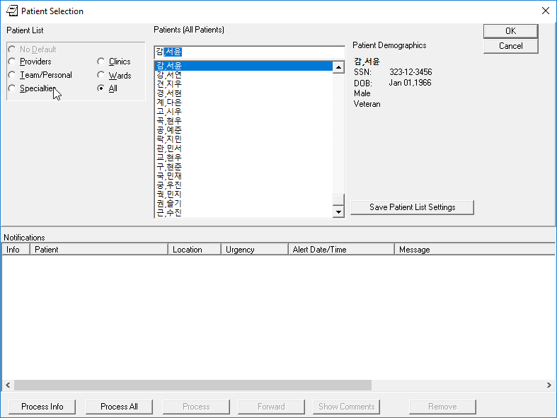

Plan VI Docker Image for quick experimentation
==============================================
After a long week of editing our OSEHRA Docker scripts, I am proud to announce
that we have a docker image for the Internationalized VistA instance that we
have been developing.

You can follow the instructions `here <https://hub.docker.com/r/osehra/ov6/>`_
to get going. There is a link there to get the clients as well. There is no
need to install the KIDS build included in the download as all of its contents
have been applied to the VistA Instance already.

As part of making this a good example to experiment with, I wrote a post-Installer
that will add Korean Text to the Introductory message; and then change the providers'
and patients' names to be a mix of Korean and Icelandic. While I tried to be culturally
correct, that remains to be seen. Here are screenshots of the introductory screen and
the patient selection prompt:

.. figure::
   images/p6-docker-1.png
   :align: center
   :alt: Intro Text

